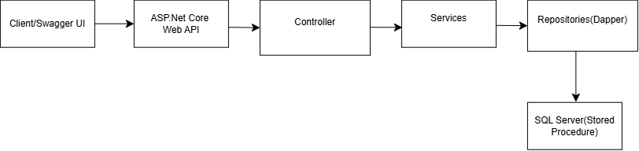
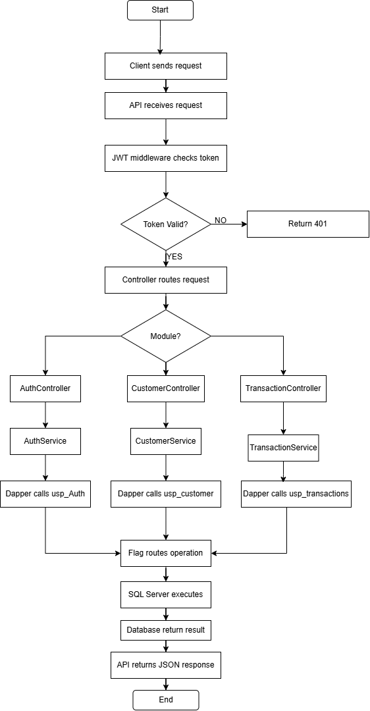


# Customer & Transaction Management API

Customer and Transaction Management is an ASP.NET Core Web API developed using .NET 9. The system manages customer information and financial transactions such as deposits and withdrawals.

The project uses Dapper for data access, SQL Server Stored Procedures for database operations, and JWT Authentication for securing APIs.
## Project Overview
The Customer & Transaction Management API provides backend services for managing customers and their financial transactions.

The system includes:

- User registration and login
- Token-based authentication
- Customer management
- Deposit management
- Withdrawal management
- Total deposit calculation
- Total withdrawal calculation
- Customer-specific transaction details
- Swagger API documentation and testing


## Key Features
-  **JWT Authentication** – User registration and  login, access tokens, and refresh tokens.
- **Customer Management** – Complete CRUD operations for customer records.
-  **Deposit Management** – Process and record customer deposits.
- **Withdrawal Management** – Process withdrawals with validation and business rules.
-  **Transaction Management** – View transaction history and individual transaction details.
-  **Transaction Reports** – Calculate total deposits, total withdrawals, and customer-specific transaction details.
-  **Dapper Data Access** – Lightweight and efficient database access using Dapper.
-  **Stored Procedures** – Database operations are handled through SQL Server stored procedures.
-  **Layered Architecture** – Controllers, Services, Repositories, and Database layers are separated for maintainability.
-  **File Upload** – Supports file upload functionality through a dedicated upload service.
-  **Swagger** – Interactive API documentation and testing.
-  **API Authorization** – Protected endpoints secured using JWT Bearer authentication.

## Technology Used
- **C#**
- **ASP.NET Core Web API**
- **.NET**
- **Dapper**
- **SQL Server**
- **JWT Authentication**
- **Swagger**
- **Visual Studio**
## Architecture

## Project Structure

```

CustomerManagement/
│
├── Controllers/
│   ├── AuthController.cs
│   ├── CustomerController.cs
│   └── ...
│
├── Models/
│   ├── User.cs
│   ├── Customer.cs
│   └── ...
│
├── DTOs/
│   ├── UserDto.cs
│   ├── CustomerDto.cs
│   └── ...
│
├── Services/
│   ├── AuthService.cs
│   ├── CustomerService.cs
│   └── ...
│
├── Repositories/
│   ├── UserRepository.cs
│   ├── CustomerRepository.cs
│   └── ...
│
├── Data/
│   ├── DbConnection.cs
│   └── StoredProcedures/
│
├── Middleware/
│   └── JwtMiddleware.cs
│
├── Helpers/
│   └── PasswordHelper.cs
│
├── Properties/
│   └── launchSettings.json
│
├── appsettings.json
├── Program.cs
├── CustomerManagement.csproj
└── README.md
```
### Folder Description

- **Controllers** – Handles HTTP requests and defines the API endpoints.
- **Models** – Contains the main entity classes used by the application.
- **DTOs** – Contains Data Transfer Objects used to control the data exchanged through the API.
- **Services** – Contains the business logic of the application.
- **Repositories** – Handles database operations using Dapper and stored procedures.
- **Data** – Contains database connection configuration and stored procedure-related files.
- **Middleware** – Contains custom middleware such as JWT authentication handling.
- **Helpers** – Contains reusable utility classes and helper methods.
- **Properties** – Contains application configuration such as launch settings.
- **appsettings.json** – Stores application configuration and database connection settings.
- **Program.cs** – Configures services, authentication, middleware, and application startup.
- **CustomerManagement.csproj** – Contains project dependencies and .NET project configuration.
- **README.md** – Contains project documentation and setup instructions.
```
```
## Database Design

The project uses **SQL Server** as the relational database and **Dapper** as the data-access technology. Database operations are mainly performed through **stored procedures**, which keep the database logic centralized and make the API easier to maintain.

The stored procedures use a **Flag-based approach**, where a single stored procedure can perform different operations depending on the value of the `Flag` parameter.

### Database Components

The database mainly manages the following areas:

- **Users** – Stores authentication and user account information.
- **Customers** – Stores customer details and profile information.
- **Transactions** – Stores deposit and withdrawal records.
- **Refresh Tokens** – Stores refresh token information used for token-based authentication.

### Stored Procedures

| Stored Procedure | Purpose |
|---|---|
| `usp_Auth` | Handles user registration and login |
| `usp_customer` | Handles customer create, read, update, and delete operations |
| `usp_transactions` | Handles deposits, withdrawals, transaction retrieval, and transaction summaries |
| `SaveRefreshToken` | Handles refresh token insertion, retrieval, and revocation |

### Flag-Based Operations

The `Flag` parameter determines which operation should be executed inside a stored procedure.

#### Customer Operations

| Flag | Operation | Description |
|---|---|---|
| `i` | Insert | Adds a new customer |
| `g` | Get All | Retrieves all customers |
| `b` | Get By ID | Retrieves a specific customer |
| `u` | Update | Updates customer information |
| `d` | Delete | Deletes a customer |

#### Transaction Operations

| Flag | Operation | Description |
|---|---|---|
| `d` | Deposit | Records a customer deposit |
| `w` | Withdrawal | Records a customer withdrawal |
| `g` | Get Transactions | Retrieves transaction records |
| `gb` | Get By ID | Retrieves a specific transaction |
| `tde` | Total Deposit | Calculates total deposited amount |
| `twi` | Total Withdrawal | Calculates total withdrawn amount |
| `cd` | Customer Deposit | Retrieves customer deposit details |
| `cw` | Customer Withdrawal | Retrieves customer withdrawal details |

#### Authentication Operations

| Flag | Operation | Description |
|---|---|---|
| `r` | Register | Creates a new user account |
| `l` | Login | Validates user credentials |

#### Refresh Token Operations

| Flag | Operation | Description |
|---|---|---|
| `i` | Insert | Stores a refresh token |
| `g` | Get | Retrieves a refresh token |
| `r` | Revoke | Invalidates a refresh token |

### Data Access Flow

The application follows this flow when performing database operations:

**API Controller → Service Layer → Dapper → Stored Procedure → SQL Server**

The controller receives the API request and passes it to the service layer. The service layer uses **Dapper** to execute the appropriate stored procedure with the required parameters and `Flag`. The stored procedure then performs the requested operation in **SQL Server** and returns the result to the application.

### Database Design Approach

The database design separates **authentication, customer management, transaction processing, and refresh token management** into logical areas. Using stored procedures with flag-based operations keeps the SQL logic centralized, while **Dapper** provides lightweight and efficient communication between the ASP.NET Core Web API and SQL Server.
## API Endpoints

The **Customer Management API** provides RESTful endpoints for managing users, customers, and financial transactions. The API is organized into separate modules to keep the functionality structured and easy to maintain.

Authentication is handled using **JWT (JSON Web Token)**. After successful login, an access token is generated for accessing protected endpoints. A refresh token can be used to generate a new access token when the current token expires.
## Flowchart

### Authentication

The Authentication module handles user registration, login, and token renewal.

| Method | Endpoint | Description |
|---|---|---|
| `POST` | `/Auth/Register` | Creates a new user account |
| `POST` | `/Auth/Login` | Authenticates the user and returns an access token |
| `POST` | `/Auth/RefreshToken` | Generates a new access token using a valid refresh token |

### Customer Management

The Customer module provides **CRUD (Create, Read, Update, Delete)** operations for managing customer records.

| Method | Endpoint | Description |
|---|---|---|
| `POST` | `/Customer` | Creates a new customer record |
| `GET` | `/Customer` | Retrieves all customer records |
| `GET` | `/Customer/{id}` | Retrieves a specific customer by ID |
| `PUT` | `/Customer/{id}` | Updates an existing customer record |
| `DELETE` | `/Customer` | Deletes a customer record |

### Transaction Management

The Transaction module manages customer financial activities, including deposits, withdrawals, transaction history, and transaction summaries.

| Method | Endpoint | Description |
|---|---|---|
| `POST` | `/Transaction/Deposit` | Records a deposit for a customer |
| `POST` | `/Transaction/Withdraw` | Records a withdrawal for a customer |
| `GET` | `/Transaction` | Retrieves transaction records |
| `GET` | `/Transaction/id` | Retrieves a transaction by ID |
| `GET` | `/Transaction/Totaldeposit` | Calculates the total deposited amount |
| `GET` | `/Transaction/Totalwithdraw` | Calculates the total withdrawn amount |
| `GET` | `/Transaction/CusDepositDetails` | Retrieves customer deposit details |
| `GET` | `/Transaction/CusWithdrawDetails` | Retrieves customer withdrawal details |

### Authorization

Protected endpoints require a valid **JWT access token**. The token is passed through the request header using the Bearer authentication scheme.


Authorization: Bearer <access_token>
## Installation & Setup
```bash
1. Clone the Repository
git clone <repository-url>
cd CustomerManagement

2. Restore Dependencies
dotnet restore

3. Build the Project
dotnet build

4. Configure Database
Update the SQL Server connection string in appsettings.json

Example:

{
  "ConnectionStrings": {
    "Default": "SQL Server Connection String"
  }
}

Then create the required stored procedures:

usp_Auth
usp_customer
usp_transactions
SaveRefreshToken

5. Configure JWT
{
  "Jwt": {
    "Issuer": "YourIssuer",
    "Audience": "YourAudience",
    "Key": "YourSecretKey",
    "TokenValidityMins": 60
  }
}

6. Run the Application
dotnet run
Open Swagger:
/swagger
```
## Screenshots
[!Authentication](files/Auth.png)
[!Bearer Token](files/Token.png)
[!Customer Management](files/Customer.png)
[!Transaction Management](files/Transaction.png)
## Security
The application uses **JWT (JSON Web Token) Authentication** to secure protected APIs and ensure that only authenticated users can access authorized resources.

### Authentication Flow

```text
User Login
    ↓
Validate Credentials
    ↓
Generate Access Token + Refresh Token
    ↓
Client Stores Tokens
    ↓
Authorization Header
    ↓
Protected API
```
### Access Token

After successful login, the system generates an **Access Token** and a **Refresh Token**. The Access Token is used to authenticate requests to protected API endpoints.

The Access Token must be included in the request header:

```http
Authorization: Bearer {AccessToken}
```
### Refresh Token

When the Access Token expires, the Refresh Token is used to generate a new Access Token without requiring the user to log in again.

Refresh tokens are stored and managed in the database using the SaveRefreshToken stored procedure.
```
Access Token Expires
        ↓
Send Refresh Token
        ↓
Validate Refresh Token
        ↓
Generate New Access Token
        ↓
Continue API Access
```
### Protected APIs

Protected endpoints require a valid JWT Access Token. Requests without a valid or authorized token are rejected, preventing unauthorized access to customer and transaction data.
## Future Improvements
- **Advanced Search and Filtering** – Add advanced search and filtering for customers and transactions.
- **Role-Based Authorization** – Introduce different access levels for different types of users.
- **Dashboard and Reports** – Add dashboards and reports for better analysis of customer and transaction data.
- **Cloud Deployment** – Deploy the application and database to a cloud platform such as Microsoft Azure.
## Learning Outcomes
- Gained practical experience in developing **ASP.NET Core Web APIs** using C# and .NET.
- Learned to implement **JWT Authentication** and secure protected API endpoints.
- Developed database operations using **SQL Server, Stored Procedures, and Dapper**.
- Improved understanding of **RESTful API development, CRUD operations, and API integration**.
- Gained experience in organizing a project using **layered architecture and separation of concerns**.
## Author
**Purnimaa Lakha**

- GitHub:https://github.com/Purniimaa
- Email:purnimaaa59@gmail.com